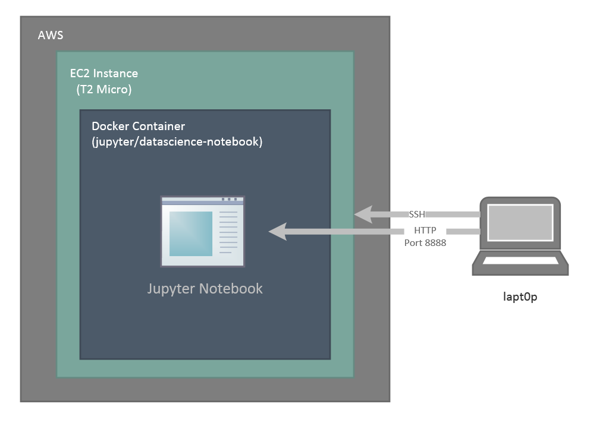

# CSX_450_1_Project_1




1. Create ssh keys on your local machine
   - install GIT bash (https://git-scm.com/downloads)
     - select vim for text editor
   - start up git bash shell, and check if you already have an ssh key created. Follow the instructions to generate a new key.
   ```
   mkdir ~/.ssh
   less ~/.ssh/id_rsa.pub
   ssh-keygen
   ```
2. Sign into AWS
3. Upload ssh key
   - select ssh key from menu on the left under "Network & Security"
   - name key by your name with the format firstname_lastname_date browse to id_rsa.pub file location and upload
   - click import
4. Create security group
   - click Security groups in the left menu under "Network & Security"
   - click "Create Security Group"
     - Name the security group
     - With the "Inbound" tab selected, we'll create 4 rules with the below values for the first 3 columns. Source should automatically populate.
       - type, protocol, port range
       - ssh, tcp, 22
       - custom, tcp, 8888
       - custom, tcp, 2376
       - custom, tcp, 27016
5. Launch EC2 instance
   - Click "EC2 Dashboard", then click "Launch Instance" (blue button in the middle of the page) to take us to the AMI selection page
   - Click "Select" for Ubuntu from the Quickstart AMI list to take us to the "Instance Type" page
   - Select t2.micro and click "Configure Instance Type" at the bottom right
   - No updates on the "Configure Instance Type" page, click through at the bottom "Add Storage"
   - Update the 4th column "Size" to 30
   - Click "Review and Launch"
   - Finally click "Launch!"
   - Click on the instance name and find the public IP address (e.g. 212.333.216.231). 
   - Click the "copy to clipboard" icon next to it.
6. Connect to EC2 instance
   - From your Bash shell, ssh to the EC2 instance 
   - When prompted for trust, type "yes"
   ```
   ssh ubuntu@212.333.216.231
   ```
7. Install docker
   - When prompted for trust, type "yes"In your SSH session, run the command "curl -sSL https://get.docker.com|sh" to install docker
   - Now run the the command "sudo usermod -aG docker ubuntu" so that we do not need to su every docker command
   - exit your ssh session, and then reconnect to load the usermod change
8. Launch jupyter docker container
   - Run the command "docker pull jupyter/datascience-notebook" to download the jupyter Docker image
   - Confirm we have the image with the command: "docker images"
   - Make a shortcut to our image, "docker tag jupyter/datascience-notebook dsnb"
   - Launch a container, run the command "docker run -v /home/ubuntu:/home/jovyan -p 8888:8888 -d dsnb"	
   - Check the STDOUT for the Jupyter login, use the container id and run "docker logs <container id>"
   - Copy the url like http://localhost:8888/?token=<some sha256> to your brower, but replace localhost with the EC2's IP address
9. git clone https://github.com/rudysenstad/UCLA_CSX_450_1_2018_W.git
